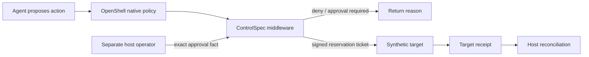

# ControlSpec + OpenShell: an experimental complement

OpenShell provides an external boundary around an agent. This experiment adds a
portable, deterministic action decision, an exact-action approval fact, a one-use
reservation, and reconciliation with a synthetic target's receipt at OpenShell's
supervisor middleware extension point.

**Verified here:** the pinned v0.1.2 protobuf interface over real TLS gRPC,
gateway-shaped signed test identities, the real ControlSpec evaluator, a separate
loopback HTTP purchase service, and persistent SQLite records. **Not yet verified:**
an actual OpenShell supervisor/sandbox run, native policy admission, network
isolation, or sandbox bypass resistance. The local Docker engine crashed before
it started. A protocol fixture is not an OpenShell runtime.

[Replay the evidence](https://huggingface.co/spaces/claytonsamples/controlspec) ·
[Upstream pin and provenance](UPSTREAM.md) ·
[Raw recorded observations](../../demo/space/openshell-traces.json)

## Reproduce without a model or paid service

From the repository root, with Python 3.13 and uv:

```sh
uv sync --project backend --locked --all-extras
uv run --project backend --locked --all-extras python scripts/build_openshell_demo.py
uv run --project backend --locked --all-extras python -m http.server 18768 --bind 127.0.0.1 --directory demo/space
```

Open `http://127.0.0.1:18768`. The recorder creates ephemeral keys and temporary
databases, starts actual TLS gRPC and loopback HTTP services, records nine scenes,
then closes the services. No inference API, account, GPU, real money or external
target is involved. The HTML replays those observations; it is not a live engine.

The example rule allows nonrecurring USD purchases up to $75. Larger one-time
purchases need a separately represented operator's exact-action approval;
recurring purchases are blocked. These are explicitly synthetic rules, not a
claim about anyone's risk appetite. The original reference catalogs are unchanged.

| Scene | What is actually observed |
| --- | --- |
| $42 allowed | Ticket issued, HTTP target mutated once, receipt reconciled |
| $142 approved | First denied; simulated operator fact added; exact retry passes |
| $142 unapproved | No target mutation |
| Approved $142, attempted $143 | Changed binding denied |
| Agent attempts approval | Invalid operator credential rejected |
| Same action repeated | No fresh reservation; target also has its own idempotency |
| Missing proof | Target effect visible; completion remains unverified |
| Middleware outage | Fixture dispatcher does not forward on RPC failure |
| Direct smolagents tool call | Controlled HTTP target rejects missing ticket |

The operator in the recording is **scripted**, not a human approval obtained
during the run. The last two scenes test the dispatcher and target respectively;
they do not establish OpenShell enforcement. Local RPC timings in raw data are
observations, not a benchmark.

## How it fits



Only the middleware-to-target part of this topology is exercised by the local
protocol fixture. OpenShell's middleware runs after native policy and before
credential injection. Its native policies already support body-aware rules.
We are not claiming it can only filter hosts, or that this control layer replaces
its isolation, policy prover, or NVIDIA Sentry hardware boundary.

The two policy files specify the same binary/host/port/method/path boundary.
[policy-controlspec.yaml](policy-controlspec.yaml) adds the final fail-closed
middleware. [policy-native.yaml](policy-native.yaml) is an illustrative native
baseline, not a strongest-possible policy or a tested native outcome. A future
fair comparison should also encode the static amount/recurrence rules natively.
Stateful approval lineage and outcome evidence are the focus of this experiment.

The controlled synthetic target additionally requires a signed ticket. The
unguarded lane calls a different target directly through Python and requires no
ticket. Both have target idempotency. Their authentication and transport differ;
neither performance nor platform superiority can be inferred from that comparison.

## Host-only services and human approval

The CLI exposes a manual operator workflow. Keep its state directory, signing
keys, gateway key and operator credentials outside all agent mounts and tools.
POSIX modes are set when creating secrets; Windows deployments need appropriate
filesystem ACLs. This is a local demo, not a production secret manager.

```sh
uv run --project backend --locked --extra openshell python -m assurance.controlspec.openshell_demo.cli --state-dir .demo-state init
uv run --project backend --locked --extra openshell python -m assurance.controlspec.openshell_demo.cli --state-dir .demo-state target
```

The middleware command requires the operator-pinned gateway ID, public Ed25519
key and key ID, plus a TLS certificate/private key whose hostname the gateway
trusts. It has no unauthenticated deployment fallback:

```sh
uv run --project backend --locked --extra openshell python -m assurance.controlspec.openshell_demo.cli --state-dir .demo-state middleware --gateway-id YOUR_GATEWAY_ID --key-id YOUR_KEY_ID --public-key gateway-public.pem --tls-cert middleware-cert.pem --tls-key middleware-key.pem
```

After the exact action is pending, run this **on the host**:

```sh
uv run --project backend --locked --extra openshell python -m assurance.controlspec.openshell_demo.cli --state-dir .demo-state approve --gateway-id YOUR_GATEWAY_ID --sandbox-id YOUR_SANDBOX_ID --action-id purchase-1
```

The command prints the action, identity, policy/decision binding and expiry; it
requires the operator to type the displayed request digest. It creates a real
ApprovalFact, then reevaluates through the unchanged core. The agent receives no
operator key. Approval is short-lived and does not reserve a different request.

For a real OpenShell trial, follow [the upstream extension configuration](https://docs.nvidia.com/openshell/latest/extensibility/supervisor-middleware/configure)
and [JWT authentication contract](https://docs.nvidia.com/openshell/latest/extensibility/overview#authenticating-extensions).
Register `controlspec-demo` with audience
`urn:openshell:extension:middleware:controlspec-demo`, HTTPS, 4096-byte payload
limit and a suitable timeout. Gateway and supervisor must both reach it. The
target is deliberately loopback-only by default: container reachability, TLS
trust, effective policy validation and deployment isolation still need to be
configured and verified on a supported host. Do not expose the state endpoint
or relabel these commands as an end-to-end OpenShell quickstart.

## smolagents

```python
from assurance.controlspec.openshell_demo.smolagents_tool import SyntheticPurchaseTool

tool = SyntheticPurchaseTool()  # operator-configured synthetic target origin
# Include tool in a smolagents agent's tools when that entire agent is sandboxed.
result = tool(action_id="purchase-1", amount_minor=4200, recurring=False)
```

The real `smolagents==1.26.0` Tool is exercised in the recording's direct-call
scene. It carries no ticket or operator credential, follows no redirects, and
does not automatically retry. It cannot enforce a security boundary on its own.
A positive agent-through-OpenShell run is future verification; none is implied
by importing a Tool or by the recorded rejection. No model call is made.

## Boundaries and next contribution

- The evaluator retains non-authoritative conformance flags. Only the isolated
  synthetic adapter interprets a permissive result for its fake target.
- Gateway/sandbox scope is authenticated in the protocol. It is not enterprise
  tenant identity. Human lineage is a tiny synthetic registry.
- Reservations and target commits are separate transactions. Unknown outcomes
  stay reserved until evidence is reconciled. There is no exactly-once claim
  across arbitrary external services.
- Same-ID replay is blocked. Fresh IDs, cumulative spending, refunds and
  economically equivalent split actions require additional policy/state.
- Tickets bind request, scope, policy, decision, method and path. The adapter
  accepts one configured origin; multi-origin ticket audiences are future work.
- Target evidence uses a shared host-trusted HMAC secret. It is not independent
  assessor identity. SQLite append-only triggers/hash chains do not defeat a
  host administrator who can rewrite the database or steal the key.
- Only strict HTTP JSON purchases are supported. No arbitrary tools, MCP,
  WebSockets, live policy writes or production control publication are offered.

The most useful next contribution is an independently reproduced, version-pinned
OpenShell runtime run with effective policies, native body-rule parity, outage
and alternate-route probes. Report failures as well as passes. This project is
independent and has no NVIDIA or Hugging Face endorsement.
